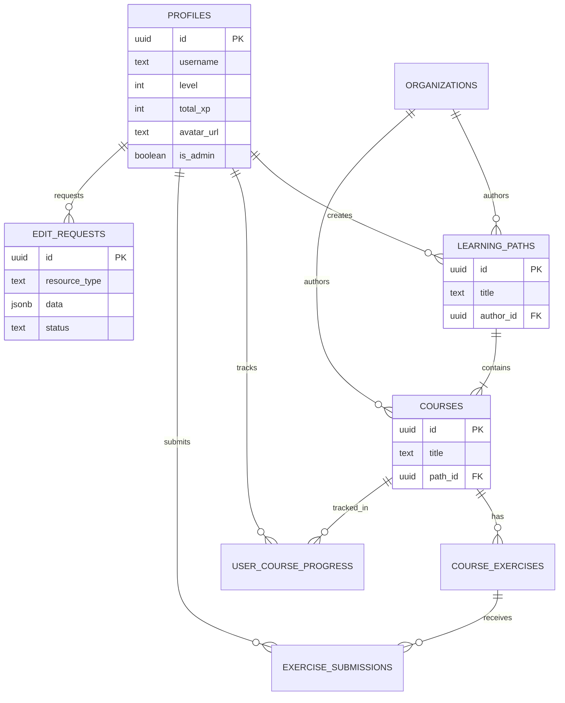

# MindBreaker Database Schema

## Overview
This document serves as the source of truth for the MindBreaker database schema, managed via Supabase (PostgreSQL).

## ER Diagram



## Tables

### Core Users
**`profiles`**
Extension of Supabase `auth.users`.
- `id`: UUID (PK, FK to `auth.users.id`)
- `username`: TEXT (Unique)
- `level`: INTEGER (Default: 1)
- `total_xp`: INTEGER (Default: 0)
- `avatar_url`: TEXT
- `is_admin`: BOOLEAN (Default: FALSE)
- `created_at`: TIMESTAMPTZ

### Content Organization
**`organizations`**
Entities that author content.
- `id`: UUID (PK)
- `name`: TEXT
- `description`: TEXT
- `website_url`: TEXT

**`learning_paths`**
Collections of courses.
- `id`: UUID (PK)
- `title`: TEXT
- `summary`: TEXT
- `description`: TEXT
- `author_id`: UUID (FK `organizations.id`)
- `created_by`: UUID (FK `profiles.id`)
- `created_at`: TIMESTAMPTZ

**`courses`**
Individual modules within a path.
- `id`: UUID (PK)
- `path_id`: UUID (FK `learning_paths.id`)
- `title`: TEXT
- `summary`: TEXT
- `description`: TEXT
- `link_url`: TEXT
- `thumbnail_url`: TEXT
- `organization_id`: UUID (FK `organizations.id`)
- `order_index`: INTEGER
- `xp_reward`: INTEGER (Default: 100)
- `created_at`: TIMESTAMPTZ

### Learning & Progress
**`course_exercises`**
Tasks associated with courses.
- `id`: UUID (PK)
- `course_id`: UUID (FK `courses.id`)
- `title`: TEXT
- `description`: TEXT
- `requirements`: TEXT

**`user_course_progress`**
Tracks completion of courses.
- `id`: UUID (PK)
- `user_id`: UUID (FK `profiles.id`)
- `course_id`: UUID (FK `courses.id`)
- `completed`: BOOLEAN
- `completed_at`: TIMESTAMPTZ
- `xp_earned`: INTEGER

**`exercise_submissions`**
User submissions for exercises.
- `id`: UUID (PK)
- `user_id`: UUID (FK `profiles.id`)
- `exercise_id`: UUID (FK `course_exercises.id`)
- `submission_type`: TEXT ('zip', 'text', 'drive', 'github')
- `file_path`: TEXT
- `drive_url`: TEXT
- `github_repo_url`: TEXT
- `status`: TEXT ('pending', 'approved', 'rejected')
- `submitted_at`: TIMESTAMPTZ

### Meta & System
**`notifications`**
- `id`: UUID (PK)
- `user_id`: UUID (FK `auth.users.id`)
- `title`: TEXT
- `message`: TEXT
- `type`: TEXT
- `link`: TEXT
- `read`: BOOLEAN

**`saved_courses` / `saved_paths`**
Bookmarks for users.

**`edit_requests`** (New/Proposed)
Generic table for content updates suggestions.
- `id`: UUID (PK)
- `resource_type`: TEXT ('course', 'path')
- `resource_id`: UUID
- `user_id`: UUID (FK `auth.users.id`)
- `data`: JSONB (The proposed changes)
- `reason`: TEXT
- `status`: TEXT ('pending', 'approved', 'rejected')

## Proposed Improvements & Optimizations

### 1. Row Level Security (RLS) Policies
Ensure all tables have RLS enabled.

```sql
-- Profiles: Public read, User update own
ALTER TABLE profiles ENABLE ROW LEVEL SECURITY;
CREATE POLICY "Public profiles" ON profiles FOR SELECT USING (true);
CREATE POLICY "Users can update own profile" ON profiles FOR UPDATE USING (auth.uid() = id);

-- Progress: User read/write own
ALTER TABLE user_course_progress ENABLE ROW LEVEL SECURITY;
CREATE POLICY "Users view own progress" ON user_course_progress FOR SELECT USING (auth.uid() = user_id);
-- ...
```

### 2. Indexes
Add indexes to foreign keys and frequently queried fields to improve performance.

```sql
-- Foreign Keys
CREATE INDEX idx_courses_path ON courses(path_id);
CREATE INDEX idx_progress_user ON user_course_progress(user_id);
CREATE INDEX idx_progress_course ON user_course_progress(course_id);

-- Status/Filtering
CREATE INDEX idx_submissions_status ON exercise_submissions(status);
CREATE INDEX idx_edit_requests_status ON edit_requests(status);
```

### 3. Triggers for `updated_at`
Add an automatic trigger to update timestamps.

```sql
CREATE EXTENSION IF NOT EXISTS moddatetime;

CREATE TRIGGER handle_updated_at BEFORE UPDATE ON profiles
  FOR EACH ROW EXECUTE PROCEDURE moddatetime (updated_at);
-- Apply to other tables
```